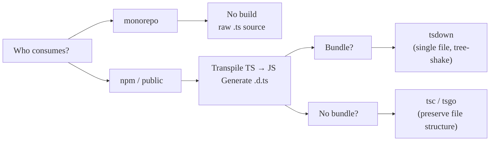

# Modern TypeScript Packaging

## 2026 Edition

Human Talks Grenoble — 2026-03-10

<div class="author">
  
  <div>
    <strong>François Best</strong>
    <span>@francoisbest.com</span>
  </div>
</div>

---

## The Landscape Has Changed

<v-clicks>

- **ESM-only** is the new default
- TypeScript 6.0 Beta
- New build tools: **tsdown** (**Rolldown**, **oxc**)

</v-clicks>

---

## ESM-Only Publishing

```jsonc {all|3|4-9|all}
// package.json
{
  "type": "module",
  "exports": {
    ".": {
      "types": "./dist/index.d.ts",
      "default": "./dist/index.js",
    },
  },
}
```

> `require(esm)` — CJS consumers can still `require()` your ESM package

---

## The Exports Map

```jsonc {all|3-7|8-11|all}
{
  "exports": {
    ".": {
      "types": "./dist/index.d.ts", // ← always first
      "browser": "./dist/index.browser.js", // ← other targets
      "default": "./dist/index.js", // ← always last
    },
    "./utils": {
      "types": "./dist/utils.d.ts",
      "default": "./dist/utils.js",
    },
  },
}
```

**Condition order matters** — `types` first, `default` last

---

## tsconfig.json for Libraries

```jsonc {all|3-5|6-8|9-11|all}
{
  "compilerOptions": {
    "target": "ES2022",             // Runtime support, modern syntax
    "module": "NodeNext",           // Node's ESM/CJS resolution rules
    "moduleResolution": "NodeNext", // Resolve imports like Node does
    "declaration": true,            // Emit .d.ts files
    "declarationMap": true,         // Go-to-definition lands on .ts source
    "sourceMap": true,              // Debuggable output
    "erasableSyntaxOnly": true,     // Native TS execution (Node 23.6+)
    "verbatimModuleSyntax": true,   // Explicit import/export type
    "isolatedDeclarations": true,   // Fast parallel .d.ts emit
  },
}
```

Shortcut: `@total-typescript/tsconfig`

---
class: px-8
---

## To Bundle or Not to Bundle?

<br/>
<br/>



---

## `erasableSyntaxOnly`

<br/>

### Blocked (needs runtime transform)

| Construct          | Use instead         |
| ------------------ | ------------------- |
| `enum`             | `as const` object   |
| `namespace`        | ES modules          |
| `param properties` | explicit assignment |

<v-click>

### Why?

Node.js **strips types natively** — zero-transform TypeScript

</v-click>

---

## TypeScript 6.0 → 7.0

<div class="grid grid-cols-2 gap-8">
<div>

### 6.0 (March 2026)

<v-clicks>

- New defaults: `strict`, `isolatedDeclarations`
- Last JS-written compiler

</v-clicks>

</div>
<div>

### 7.0 — `tsgo`

<v-clicks>

- Full rewrite in **Go**
- **10x faster** type-checking
- Native CLI: `tsgo --build`

</v-clicks>

</div>
</div>

---

## Build Tools — 2026

| Tool       | Engine         | Bundle | .d.ts         |
| ---------- | -------------- | ------ | ------------- |
| **tsdown** | Rolldown + oxc | yes    | isolated decl |
| tsup       | esbuild        | yes    | via tsc       |
| tsc / tsgo | TS compiler    | no     | yes           |

<v-click>

**tsdown** = the one to watch (VoidZero / Evan You)

</v-click>

---
layout: two-cols
---

## Monorepo

```
packages/
  shared/
    src/index.ts     ← raw .ts, no build
    package.json
  app/
    src/main.ts      ← imports @repo/shared
    package.json
```

::right::

## Internal Packages

<div class="">

```jsonc
// packages/shared/package.json
{
  "name": "@repo/shared",
  "exports": {
    ".": "./src/index.ts",
  },
}
```

<v-click>

Only build **at the boundary**

</v-click>

</div>

---

## Before You Publish

```bash
# Lint your package.json
npx publint

# Check TypeScript resolution for all consumers
npx @arethetypeswrong/cli --pack
```

<v-click>

```
 ✅ node10     ✅ node16-esm     ✅ bundler
 ✅ node16-cjs ✅ node16-esm
```

</v-click>

---

## TL;DR — 2026 Defaults

|          | npm library                       | monorepo pkg |
| -------- | --------------------------------- | ------------ |
| Format   | ESM-only                          | raw `.ts`    |
| Build    | **tsdown**                        | none         |
| tsconfig | `NodeNext` + `erasableSyntaxOnly` | bundler mode |
| Types    | `isolatedDeclarations`            | source       |
| Validate | `publint` + `attw`                | —            |
| Registry | **npm** (or JSR)                  | workspace    |

<div class="mt-8 text-center opacity-75">

publint.dev · arethetypeswrong.github.io · tsdown.dev

</div>

---
layout: center
---

# Thank you!

<br/>

Slides, coding agent skill & resources:


<div class="mt-2 text-sm opacity-50">

https://github.com/franky47/2026-03-10-human-talks-modern-typescript-packaging

</div>
